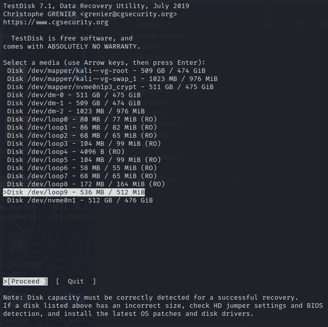
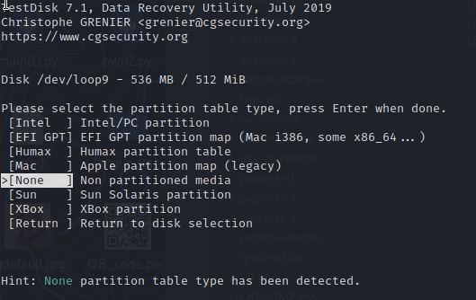
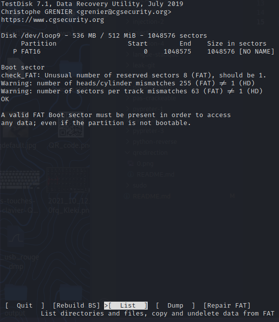
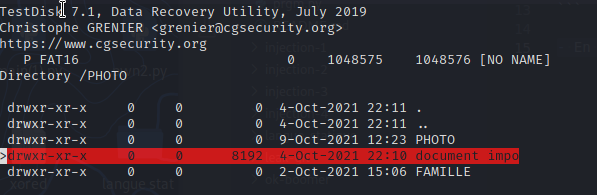

# La clé USB du jardin secret

Le challenge nous donne un dump de clé usb.

## Monter le système de fichiers

- Pour monter le dump on lance : `sudo mount "/home/user/Desktop/cle_usb_rouge.dmp" "/mnt/gen"`
- Dans le dossier on a :

```
$ ls
photo  'System Volume Information'   travail
``` 

- En se baladant on ne trouve rien d'intéressant donc on lance testdisk :









- Il suffit de récupérer se dossier et de lire le contenu du fichier texte !