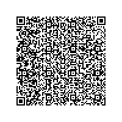

# Inception



## Lire le QR Code

- En lisant le QR code on obtient :

```
255 255 255 248
255 255 255 248
192 82 144 24
223 112 215 216
209 92 180 88
209 79 84 88
209 78 212 88
223 111 119 216
192 85 80 24
255 233 191 248
195 93 236 88
226 201 99 88
230 122 107 120
251 254 108 120
197 110 163 24
249 213 145 120
239 60 94 184
217 147 63 216
242 36 193 152
255 220 29 248
192 119 84 24
223 127 93 152
209 100 64 152
209 80 64 152
209 88 253 184
223 90 98 120
192 77 104 24
255 255 255 248
255 255 255 248
0 0 0 0
0 0 0 0
0 0 0 0
```

- On remarque qu'il y a 4 colonnes pour 32 lignes, mais si l'on représente les nombres en bits, 32 lignes pour 32 colonnes : UN QR CODE !

## Recréer le nouveau QR Code

- On convertit déjà tout en bits :

```py
L = """255 255 255 248
255 255 255 248
192 82 144 24
223 112 215 216
209 92 180 88
209 79 84 88
209 78 212 88
223 111 119 216
192 85 80 24
255 233 191 248
195 93 236 88
226 201 99 88
230 122 107 120
251 254 108 120
197 110 163 24
249 213 145 120
239 60 94 184
217 147 63 216
242 36 193 152
255 220 29 248
192 119 84 24
223 127 93 152
209 100 64 152
209 80 64 152
209 88 253 184
223 90 98 120
192 77 104 24
255 255 255 248
255 255 255 248
0 0 0 0
0 0 0 0
0 0 0 0"""

lignes = L.split("\n")

y = ""

for ligne in lignes:
    couleurs = ligne.split(" ")
    R,G,B,A = couleurs[0],couleurs[1],couleurs[2],couleurs[3]
    current = "{:08b}".format(int(R))+"{:08b}".format(int(G))+"{:08b}".format(int(B))+"{:08b}".format(int(A))
    y += current + "\n"
    

print(y)
```

- Et ensuite on peut convertir ces bits en QR Code avec un site comme [celui-ci](https://bahamas10.github.io/binary-to-qrcode/)