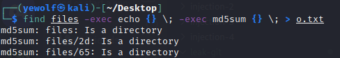

# Leak de Git

On a un dossier, avec pleins de dossier, qui contiennent plein de fichier et on cherche un fichier qui a un certains MD5.

## Résolution

- Avec `md5sum`, on est capable de calculé le dit hash d'un fichier.
- Avec `find`, on peut récursiver sur tout les fichiers.

Il suffit juste de lancer ça : 

- `find files -exec echo {} ; -exec md5sum {} ; > o.txt` 

Et voilà :

- Il suffit maintenant de CTRL+F dans notre fichier `o.txt` et c'est tout bon.