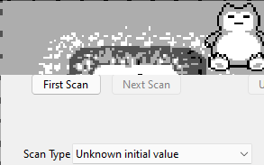
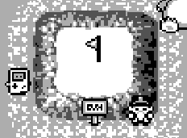

# OK BOOMER (Avec CE)

D'abord, avoir un émulateur c'est cool, j'ai choisis mGBA.
Ensuite avoir Cheat Engine pour modifier la mémoire.

## Trouver la bonne addresse :

 - On va se mettre de se côté pour rendre les choses plus simples et on se limite à des mouvements suivant la verticale.

	
 - Il faut préparer le scan à partir d'une valeur inconnue puis quand on descend on scan avec comme paramètre "Valeur qui grandis" (l'inverse quand on monte) :
 

 - En trifouillant les deux valeurs, on se rend compte que la seconde est la plus interessante.
 

 - On se place au bon endroit.
 

 - Puis en allant dans la mémoire on modifie la partie la plus haute : 
 

 - On peut ensuite récupérer le flag :
 
