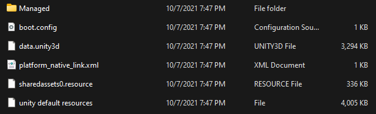
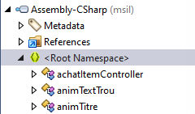
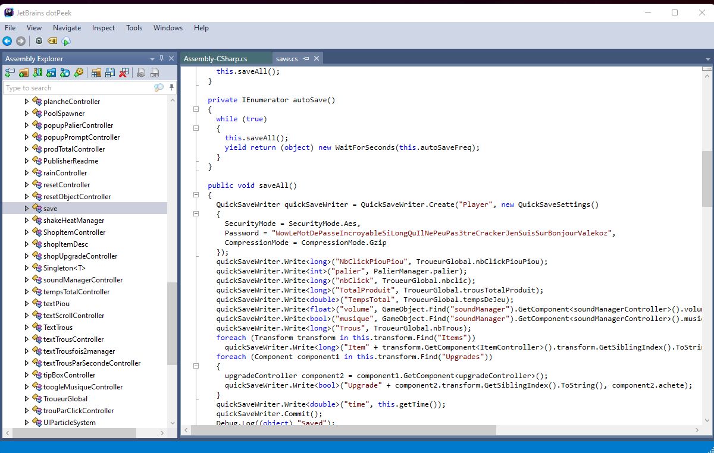

# Il ne peut pas être cracké

On a un apk, donc on le décompile INSTANTANÉMENT. (il y a des décompilateurs en ligne, ou jadx)

## Analyse des fichiers

 - On voit qu'on à une application faites avec Unity. L'un des fichiers clé est Assembly-CSharp.dll
 - Et en plus c'est simple a décompiler avec JetBrains dotPeek
 - En important le fichier, on s'intéresse à la partie dans `<Root Namespace>`
 

 - Plus qu'à chercher les saves.
 

 - Et voilà ! (Comme quoi, il nous a bien mentis en disant que c'était sécurisé !)